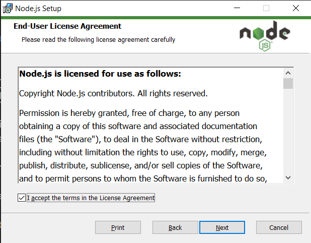
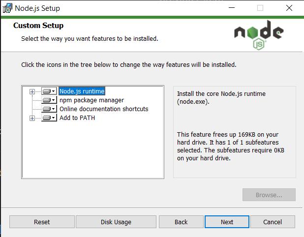

## :dvd: Install Node.js and NPM

1. Download [Node.js version v14.17.6 Windows Installer](https://nodejs.org/download/release/v14.17.6/node-v14.17.6-x64.msi)

1. Run the installer (the .msi file you downloaded in the previous step)

1. Follow the prompts in the installer

    - Accept the license agreement

      

    - Click the `Next` button a few times and accept the default installation settings

      

1. Restart your computer if prompted

1. Check Node and NPM are installed

   - Open the Windows Command Prompt, Powershell or a similar command line tool, and type:

     ```bash
     node -v
     ```

     This should print the version number so you’ll see something like this `v14.17.6`.

     We recommend Node.js version v14.17.6

   - Also on the command line, type:

     ```bash
     npm -v
     ```

     You should see something like this `6.14.13`.

## All done?

__[:point_right: I have installed Node](../c1e4/c1e4.md)__
